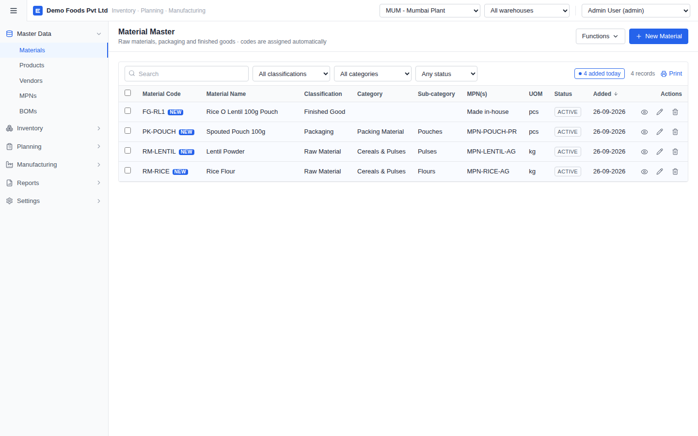
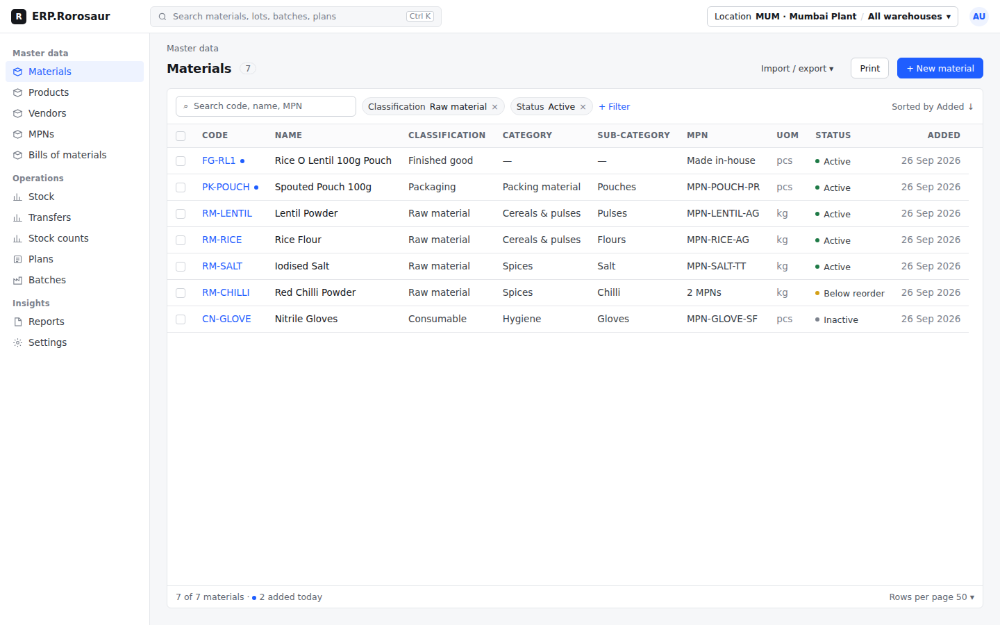
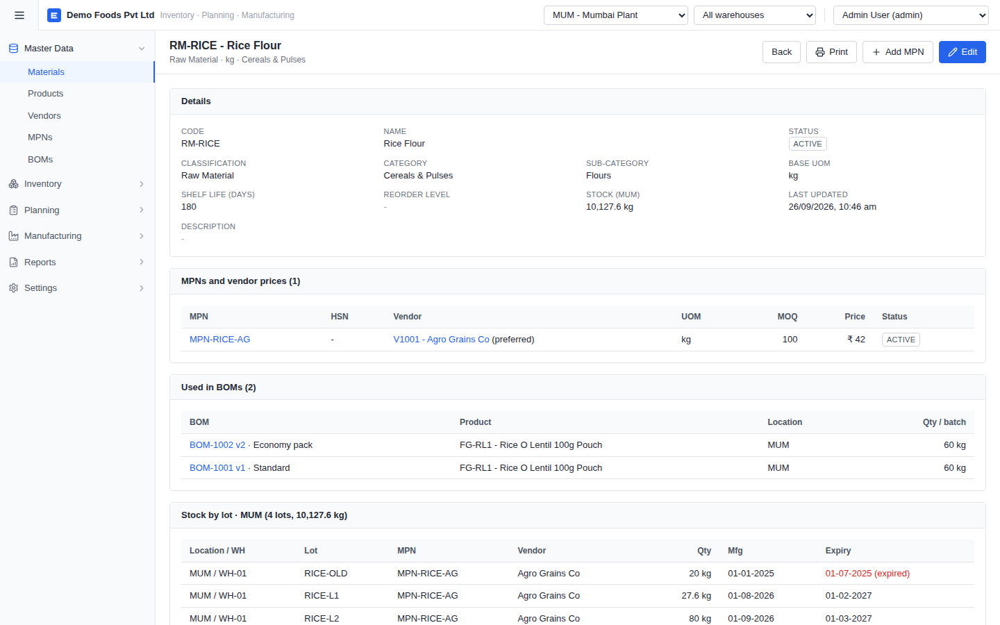
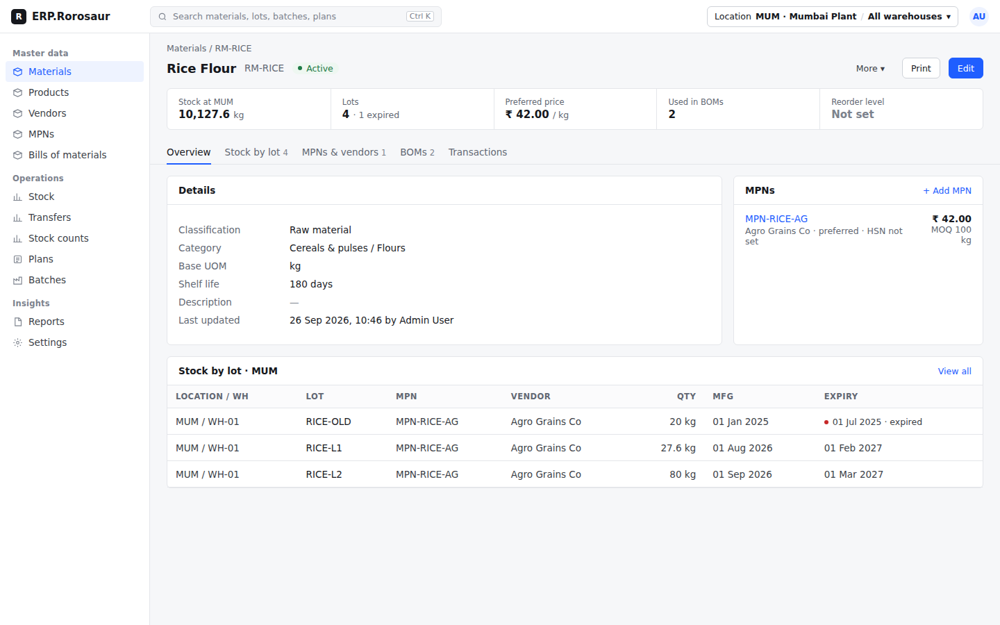
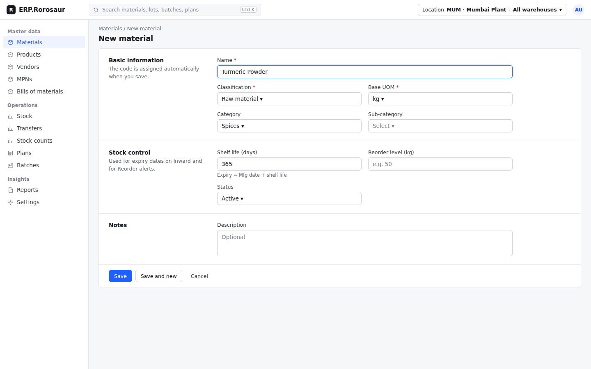

# ERP.Rorosaur v11: UI / UX redesign of the module pages

Status: **PLAN, waiting for approval.** No app code changes until approved.

## 1. Request

> "I want the UI and UX for the modules page where I want CSS style and it's looking vibe coded."

Goal: make every module page (Masters, Inventory, Planning, Manufacturing, Reports, Settings) look like one designed product, not a set of generated screens.

The look stays within the project rules:

- White surfaces with dark grey text.
- Light grey borders.
- One blue accent.
- No gradients or flashy animation.
- High data density.

This is a visual and layout change only. No backend, API, database or business-rule changes. Every feature, filter, print option and test keeps working.

## 2. Why it looks "vibe coded" today

These findings come from an audit of the current code and screens (`docs/v11/before_*.png`).

| # | Problem | Where / evidence |
|---|---|---|
| 1 | **Default Tailwind look.** Stock gray-50 panels, blue-600, the system font and 4px corners everywhere. It reads as a template, not a product. | `tailwind.config.js`, `index.css` |
| 2 | **No type scale.** 63 hard-coded `text-[13px]` plus 11, 14, 15 and 16px one-offs. Headings, labels and cells have no clear hierarchy. | all pages |
| 3 | **Explanatory sentences as subtitles** on almost every page ("codes are assigned automatically", "Grouped by product...", "Click a row to trace the lot..."). They add noise and make pages feel like a demo. | PageHeader subtitles |
| 4 | **Top bar is three native `<select>`s** (location, warehouse, user) plus the tagline "Inventory · Planning · Manufacturing". | `Layout.jsx` |
| 5 | **Filters are loose native dropdowns** with fixed widths ("All classifications", "Any status"). Nothing shows at a glance what is filtered. | every list page |
| 6 | **Loud row tags.** A blue "NEW" badge on every new row, and a boxed "4 added today" pill. | DataTable |
| 7 | **Status has no meaning.** Every status is the same grey outlined uppercase box (ACTIVE, IN PROGRESS). Expired, short and inactive look alike. | `Status` component |
| 8 | **Detail pages are one long scroll** of identical grey-header cards: Details, MPNs, BOMs, Stock, Transactions. Key numbers (stock, price, lots) sit in a grid of tiny UPPERCASE labels. | Material, MPN, Vendor, BOM, Plan, Batch views |
| 9 | **Forms vary.** Some are pop-ups, some full pages, all in one flat grid. There are no section headings, the grey hints are hard to read, and nothing marks "required" consistently. | MaterialForm, MpnForm, Inward, Batch Entry |
| 10 | **Spacing drifts:** `p-4` / `p-5`, `space-y-3` / `space-y-4`, 8 / 12 / 16px gaps mixed on the same screen. Short tables leave a large empty white area. | page wrappers |
| 11 | **Accessibility gaps.** Inputs remove the focus outline (`focus:outline-none`). Faint text (#9ca3af) fails contrast. Icon-only row buttons have no labels. | `index.css`, action columns |
| 12 | **Mixed date formats:** `26-09-2026`, `26/09/2026, 10:46 am` and `2026-09-26` on the same pages. | format helpers |

## 3. Proposed design (see mockups)

| Before | After (mockup) |
|---|---|
|  |  |
|  |  |
| (pop-up form) |  |

The mockups are static and use illustrative data. The source is `docs/v11/mockup.html`; open it in a browser with `?s=list`, `?s=detail` or `?s=form`.

### 3.1 Design tokens (one place, CSS variables)

- **Colours**, as CSS variables in `index.css` and mapped into Tailwind:
  - canvas `#f6f7f9`, surface `#fff`
  - ink 900 / 700 / 500 / 400
  - line `#e4e6ea`, line-strong `#cfd3d9`
  - accent `#1f5eff` (the single accent)
  - danger `#c62828`
- **Status colours** are used only as a 6px dot next to the status text, never as fills:
  - ok (green): Active, Completed
  - warn (amber): Below reorder, In transit, Expiring soon
  - danger (red): Expired, Short, Cancelled
  - neutral (grey): Draft, Inactive
- **Type scale:** 11.5 / 12.5 / 13.5 / 15 / 18px, used only through classes (`text-xs`, `text-sm`, `text-base`, `text-lg`, `text-xl`).
  - Font: **Inter**, bundled with the app (`@fontsource/inter`, no CDN), with tabular numbers so quantity columns line up.
- **Spacing** on a 4px grid.
  - Page gutter 24px, card padding 16px, table cell padding 12px, row height 38px.
- **Radius and depth:** 4px for inputs and chips, 6px for cards and buttons. One subtle shadow, used only for menus and dialogs.

### 3.2 App shell

- **Top bar:**
  - Left: an "ERP.Rorosaur" wordmark.
  - Middle: a global search box (Ctrl K) that finds materials, MPNs, lots, batches and plans.
  - Right: **one scope button**, "Location MUM · Mumbai Plant / All warehouses ▾", which opens a small panel with both pickers.
  - Far right: a user avatar menu (switch user, settings).
  - The three native selects and the tagline are removed.
- **Sidebar:** white, grouped under small section labels (Master data / Operations / Insights). There is an icon on every item, 30px rows, and a clear active state (accent tint and accent text). It collapses to icons below 1280px.

### 3.3 Page templates (every module page uses one of three)

1. **List page**
   - Breadcrumb, title and record count. On the right, the primary action and secondary actions (Print; Import/Export inside a menu).
   - One sheet card that fills the page height, so there is no empty white gap:
     - **Filter bar:** a search box plus **filter chips** ("Classification: Raw material ×", "+ Filter"). All current filters (classification, category, status, location, type, HSN...) move into chips.
     - **Table:**
       - Sticky header with small caps headers.
       - Code column as an accent link; numbers right-aligned in tabular figures.
       - Status as dot + text.
       - The row action ("Edit ⋯") appears on hover. It stays keyboard-reachable and labelled.
       - The "NEW" badge becomes a small accent dot with an "Added today" tooltip.
     - **Footer:** "7 of 7 materials · 2 added today", the rows-per-page choice and Print/CSV.
2. **Record (detail) page**
   - Breadcrumb, then the name, code and status.
   - Actions on the right: primary **Edit**, Print, and a **More ▾** menu (Copy, Add MPN, Create BOM, Delete...).
   - A **key facts strip** of 4–6 numbers: stock, lots, price, BOM count, reorder level (per page type).
   - **Tabs** instead of one long scroll: Overview, Stock by lot, MPNs & vendors, BOMs, Transactions (per page type).
   - Overview uses a two-column label / value list, not UPPERCASE mini labels.
   - Applies to Material, Product, MPN, Vendor, BOM, Plan, Batch, Transfer and Stock Count.
3. **Form page**
   - Breadcrumb and title.
   - Sections with a left title and short description, and the fields on the right (Zoho style): Basic information, Stock control, Vendors & prices, Notes.
   - Required fields marked `*`, errors shown under the field, a visible focus ring, and a sticky footer with Save / Save and new / Cancel.
   - Applies to Material, Product, MPN, Vendor, BOM edit and New Plan.
   - Short actions stay as dialogs (Delete, Reverse, Edit target, Inward, Outward, Transfer, Adjust) but use the same field style. Dialogs come in three sizes only.
   - Operational entry screens follow the form template with numbered sections: Batch Entry (Batch → Output → Material inputs) and Stock Count entry.

### 3.4 Shared components (built once in `components/`)

- **Existing, restyled:** `Button` (primary / secondary / ghost / danger; sm / md), `Status`, `DataTable`, `Modal`, `Field`, `PrintDialog`.
- **New:**
  - Page and navigation: `Breadcrumb`, `PageHeader` (restyled), `KeyFacts`, `Tabs` (restyled), `Section`.
  - Filters and menus: `FilterBar` + `FilterChip`, `Menu` (dropdown actions), `ScopePicker`.
  - States and feedback:
    - `EmptyState` (with the next action, e.g. "No BOMs at MUM yet · Create BOM").
    - Skeleton loading rows.
    - Toast, bottom-right, auto-dismiss.

### 3.5 Content and consistency rules

- Page subtitles are removed. Needed help moves to an (i) tooltip or one line inside the relevant section.
- Sentence case everywhere ("New material", "Bills of materials").
- Dates are always `26 Sep 2026`, and `26 Sep 2026, 10:46` for times. Numbers use Indian grouping and always show a unit.
- Empty values show an en dash `–`.

## 4. Phases (after approval)

| Phase | Work | Check |
|---|---|---|
| A | Tokens, Inter font, base CSS, Tailwind mapping, focus rings, contrast fixes | build + lint |
| B | App shell: top bar, scope picker, user menu, sidebar groups/icons, global search (read-only lookup on existing APIs) | Playwright nav script |
| C | Shared components (3.4); `Status` → dot + text; DataTable restyle, filter chips, footer, hover actions | unit render in all lists |
| D | List pages (15): Materials, Products, Vendors, MPNs, BOMs, Stock, Transfers, Stock counts, Plans, Batches, Stock balance, Physical sheet, Transactions, Reorder, Traceability | before/after screenshots |
| E | Record pages (9) with key facts and tabs | screenshots + existing e2e |
| F | Form pages and dialogs (Material, Product, MPN, Vendor, BOM, New Plan, Batch Entry, Inward/Outward/Transfer/Adjust) | e2e batch + inward flows |
| G | Settings pages, print header polish (prints keep the current clean A4 layout) | PDF print script |
| H | Clean-up gate: no `text-[..px]` or raw palette colours left in pages (a lint rule enforces this); accessibility check with axe on every page (no serious issues); full `npm run check`; screenshot set of every page | CI-style check |

Delivery: one branch `feat/v11-ui`, with a commit per phase, and before/after screenshots of every page in `docs/v11/`.

## 5. Decisions (defaults; change any you want)

1. **Status colours.** The default is a small coloured dot (green / amber / red / grey) beside the text, with no coloured fills. Alternative: fully monochrome, where only Expired and Short use red text.
2. **Font.** The default is Inter, bundled locally. Alternative: keep the system font.
3. **Sidebar.** The default is a light sidebar. Alternative: a dark navy sidebar, like newer Zoho apps.
4. **Detail pages.** The default is tabs. Alternative: keep the long scroll but add the key facts strip and a section jump-bar.
5. **Global search (Ctrl K).** Included by default, using the existing list APIs with no new backend. It can be left out to keep v11 purely visual.
6. **Density.** The default row height is 38px. Alternative: a "Compact" (32px) toggle in Settings.

## 6. Not in scope

- New features.
- Role changes (still deferred).
- Mobile layouts (target 1280px and wider; tablet-friendly where cheap).
- Dark mode.
- Changes to print layouts beyond header polish.

## 7. Session log

- 2026-09-26: v10 gaps closed first (see `ERP_V10_PLAN.md` session log). UI audit done, mockups made, this plan written. Waiting for approval.
